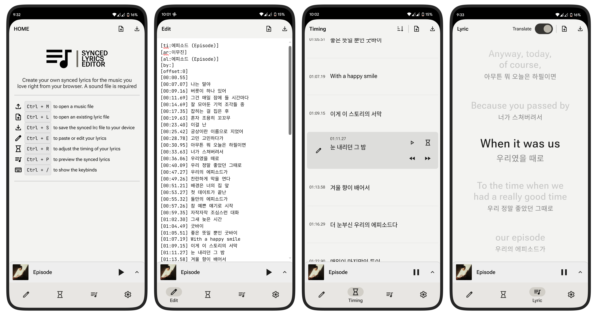
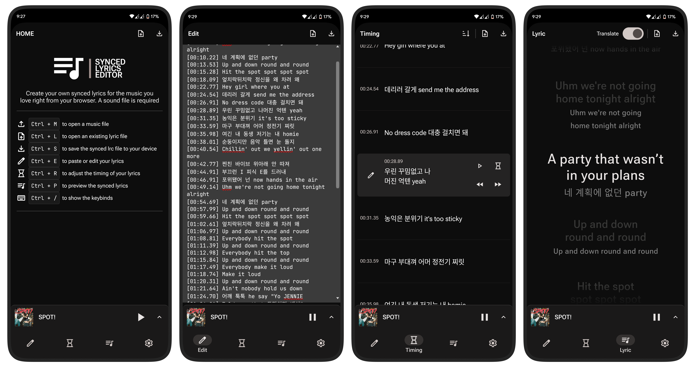

# Synced Lyrics Editor and Maker

### Straightforward LRC Maker and Editor.

Create your own synced lyrics for the music you love – right from your browser. A sound file is required.

_That's a queue icon though..._

## Screenshots

## Features

- Paste or edit lyrics
- Sync lyrics realtime while the sound is playing
- Tags support
- Realtime preview and translated preview
- Local session editing and saving
- Installable as a PWA
- Light and dark mode

## Get Started

- Clone the repository
- Install dependencies
  - `npm install` or `yarn` or `pnpm install` or `bun install`
- Open development server:
  - `npm run dev` or `yarn dev` or `pnpm dev` or `bun run dev`
- Build:
  - `npm run build` or `yarn build` or `pnpm build` or `bun run build`

## Changelog

You can check the [changelog](public/changelog.md) for more details.

## Contributing

If you have any questions or suggestions, please feel free to [open an issue](https://github.com/obillekyle/synced-lyrics-editor-webapp-v2/issues) or [open a pull request](https://github.com/obillekyle/synced-lyrics-editor-webapp-v2/pulls).
